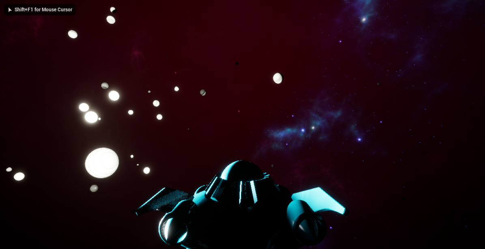

# Orbit3D
A 3D adaptation of the Exploration mode in my orbit-sandbox project, created using Unreal Engine 4.

02/06/19: The current version of the game includes a number of untextured spheres which spawn over time and exert gravitational forces on each other. Just as in the 2D version, when two spheres collide they combine into one larger sphere. A sky sphere, created using the [Spacescape](http://alexcpeterson.com/spacescape/) tool, encapsulates the player's vision. The player currently controls the pre-made spaceship included in the example "Flying" C++ project.

03/06/19: Each sphere that spawns has a chance to be given a point light component, much more realistically illuminating all other objects within the sky sphere.

03/06/19: Each sphere now randomly chooses 1 of 9 materials when it is spawned. If the material chosen is the Sun material, a point light component is created and attached to the sphere.

